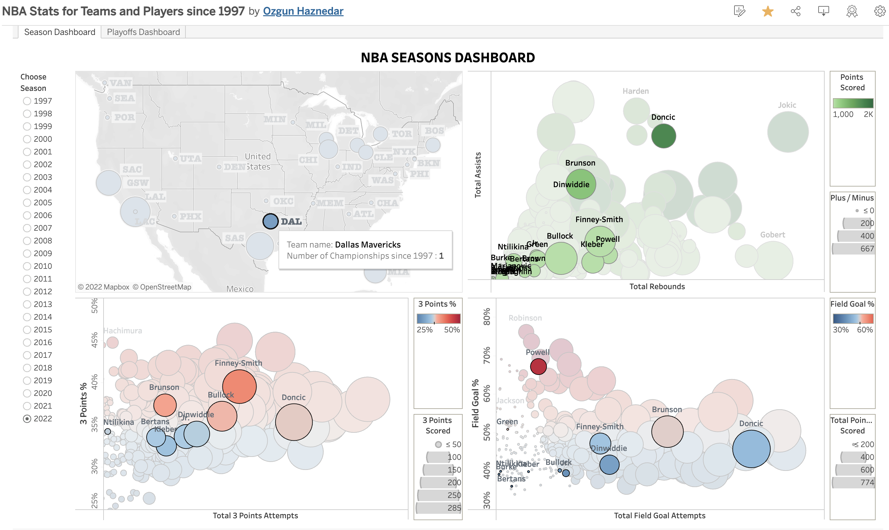

# Data Collection with Webscraping for NBA Data Visualization Project

#### -- Project Status: [ Completed]

## Project Intro/Objective
The purpose of this project is to visualize the NBA teams and players for each season starting from 1997 and to understand key players of a team in each season.

## tableau Visualization Link
https://public.tableau.com/views/NBAStatsforTeamsandPlayerssince1997/SeasonDashboard?:language=en-US&:display_count=n&:origin=viz_share_link

## Methods Used
* Exploratory Data Analysis
* Data Visualization
* Webscraping

## Technologies

* Python
* Pandas, jupyter
* tableau public
* beatifulsoup
* selenium

## Project article

More detailed explanation about the project can be found in the medium article.
https://medium.com/@ozgunhaznedar/nba-team-analyzes-dashboard-with-tableau-public-72eb87e8d838
